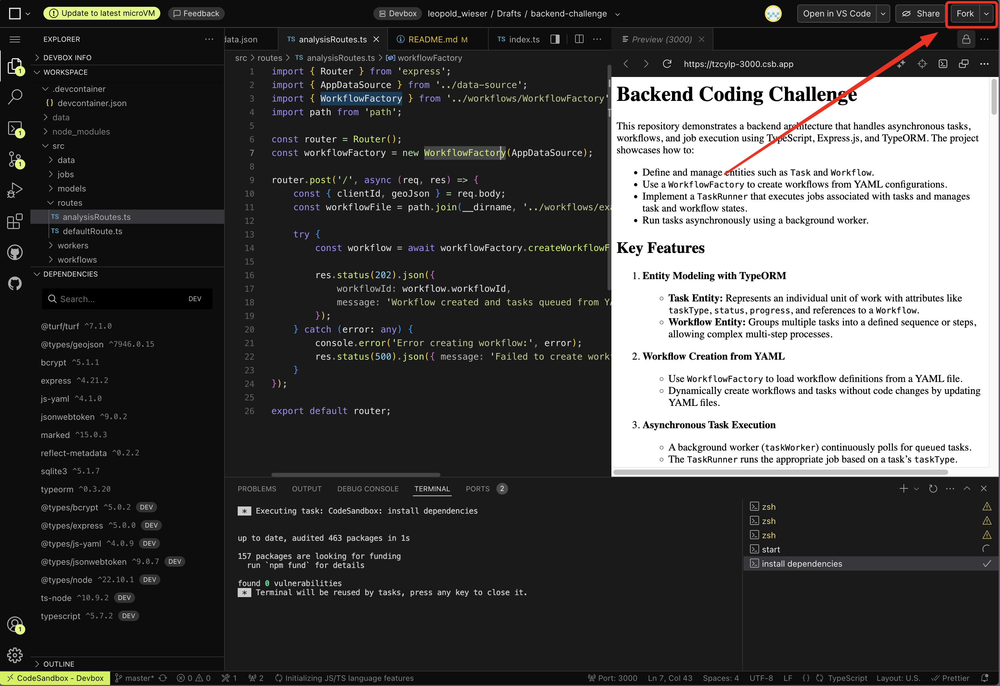

# Backend Coding Challenge

## Getting Started

1. Fork the Project:
   
2. Start Coding

This repository demonstrates a backend architecture that handles asynchronous tasks, workflows, and job execution using TypeScript, Express.js, and TypeORM. The project showcases how to:

- Define and manage entities such as `Task` and `Workflow`.
- Use a `WorkflowFactory` to create workflows from YAML configurations.
- Implement a `TaskRunner` that executes jobs associated with tasks and manages task and workflow states.
- Run tasks asynchronously using a background worker.

## Key Features

1. **Entity Modeling with TypeORM**

   - **Task Entity:** Represents an individual unit of work with attributes like `taskType`, `status`, `progress`, and references to a `Workflow`.
   - **Workflow Entity:** Groups multiple tasks into a defined sequence or steps, allowing complex multi-step processes.

2. **Workflow Creation from YAML**

   - Use `WorkflowFactory` to load workflow definitions from a YAML file.
   - Dynamically create workflows and tasks without code changes by updating YAML files.

3. **Asynchronous Task Execution**

   - A background worker (`taskWorker`) continuously polls for `queued` tasks.
   - The `TaskRunner` runs the appropriate job based on a task’s `taskType`.

4. **Robust Status Management**

   - `TaskRunner` updates the status of tasks (from `queued` to `in_progress`, `completed`, or `failed`).
   - Workflow status is evaluated after each task completes, ensuring you know when the entire workflow is `completed` or `failed`.

5. **Dependency Injection and Decoupling**

   - `TaskRunner` takes in only the `Task` and determines the correct job internally.
   - `TaskRunner` handles task state transitions, leaving the background worker clean and focused on orchestration.

## New Features Implemented

### **Polygon Area Calculation Job**

- Calculates the area of GeoJSON polygons using `@turf/area`
- Handles invalid GeoJSON gracefully
- Returns area in square meters

### **Report Generation Job**

- Aggregates outputs from all preceding tasks in the workflow
- Generates comprehensive JSON reports
- Includes task summaries and final analysis

### **Interdependent Tasks Support**

- Tasks can depend on outputs of previous tasks
- Automatic dependency resolution and execution ordering
- YAML configuration support for task dependencies

### **Final Workflow Results**

- Automatic aggregation of all task outputs
- Saved in `Result` table and added in `Workflow.finalResult` field
- Accessible via API endpoints

### **Workflow Status API**

- Real-time workflow progress tracking
- Task completion counters
- Status monitoring endpoint

### **Workflow Results API**

- Retrieve final aggregated results
- Only available for completed workflows
- Comprehensive result formatting

## Project Structure

```
src
├─ models/
│   ├─ world_data.json  # Contains world data for analysis
│
├─ models/
│   ├─ Result.ts        # Defines the Result entity
│   ├─ Task.ts          # Defines the Task entity
│   ├─ Workflow.ts      # Defines the Workflow entity
│
├─ jobs/
│   ├─ Job.ts           # Job interface
│   ├─ JobFactory.ts    # getJobForTaskType execution & task/workflow state transitions
│   ├─ DataAnalysisJob.ts # Geographic data analysis job
│   ├─ EmailNotificationJob.ts # Simulating email notification with a delay job
│   ├─ PolygonAreaJob.ts # NEW: Polygon area calculation job
│   ├─ ReportGenerationJob.ts # NEW: Report aggregation job
│
├─ workflows/
│   ├─ WorkflowFactory.ts  # Creates workflows & tasks from a YAML definition
│   ├─ example_workflow.yml # Workflow definition with dependencies
│
├─ workers/
│   ├─ taskWorker.ts    # Background worker that fetches queued tasks & runs them
│   ├─ TaskRunner.ts    # Handles job
│
├─ routes/
│   ├─ analysisRoutes.ts # POST /analysis endpoint to create workflows
│   ├─ workflowRoutes.ts # GET /workflow/:id/status and GET /workflow/:id/results endpoints to get status and reports of workflows
│
├─ data-source.ts       # TypeORM DataSource configuration
└─ index.ts             # Express.js server initialization & starting the worker
```

## Getting Started Installation and Setup

### Prerequisites

- Node.js (LTS recommended)
- npm or yarn
- SQLite or another supported database

### Installation

1. **Clone the repository:**

   ```bash
   git clone https://github.com/msuraj11/backend-challenge-osp.git
   cd backend-challenge-osp
   ```

2. **Install dependencies:**

   ```bash
   npm install
   ```

3. **Configure TypeORM:**

   - Edit `data-source.ts` to ensure the `entities` array includes `Task` and `Workflow` entities.
   - Confirm database settings (e.g. SQLite file path).

4. **Create or Update the Workflow YAML:**
   - Place a YAML file (e.g. `example_workflow.yml`) in a `workflows/` directory.
   - Define steps, for example:
     ```yaml
     name: 'example_workflow'
     steps:
       - taskType: 'analysis'
         stepNumber: 1
       - taskType: 'notification'
         stepNumber: 2
     ```

### Running the Application

1. **Compile TypeScript (optional if using `ts-node`):**

   ```bash
   npx tsc
   ```

2. **Start the server:**

   ```bash
   npm start
   ```

   The server will start on port 3000 and initialize the database automatically.
   If using `ts-node`, this will start the Express.js server and the background worker after database initialization.

## API Documentation

### **POST /analysis**

Creates a new analysis workflow.

**Request Body:**

```json
{
  "clientId": "client123",
  "geoJson": {
    "type": "Polygon",
    "coordinates": [
      [
        [-63.624885020050996, -10.311050368263523],
        [-63.624885020050996, -10.367865108370523],
        [-63.61278302732815, -10.367865108370523],
        [-63.61278302732815, -10.311050368263523],
        [-63.624885020050996, -10.311050368263523]
      ]
    ]
  }
}
```

**Response:**

```json
{
  "workflowId": "753bd1af-70a6-4921-9a78-708353d30934",
  "currentStatus": "initial",
  "message": "Workflow created and tasks queued from YAML definition."
}
```

### **GET /workflow/:id/status**

Retrieves the current status of a workflow.

**Response:**

```json
{
  "workflowId": "3433c76d-f226-4c91-afb5-7dfc7accab24",
  "status": "in_progress",
  "completedTasks": 2,
  "totalTasks": 4
}
```

**Status Values:**

- `queued` - Workflow created, tasks not started
- `in_progress` - Some tasks completed, others pending
- `completed` - All tasks finished successfully
- `failed` - One or more tasks failed

### **GET /workflow/:id/results**

Retrieves the final results of a completed workflow.

**Response (Success):**

```json
{
  "workflowId": "88a7043b-22d2-431e-8a60-a392d4d7d0ca",
  "status": "completed",
  "finalResult": {
    "completedAt": "2025-07-27T00:56:21.271Z",
    "tasksCompleted": 4,
    "totalTasks": 4,
    "results": [
      {
        "taskId": "9d08069a-c3e8-49fa-9844-6f674b8e6017",
        "taskType": "analysis",
        "output": {
          "polygonType": "Polygon",
          "coordinatesCount": 5,
          "summary": "The polygon is within Brazil",
          "analysisDoneOn": "2025-07-27T00:56:20.719Z"
        }
      },
      {
        "taskId": "92e693ae-e878-46ef-81c9-df707186daac",
        "taskType": "calculatePolygonArea",
        "output": {
          "area": 8363324.273315565,
          "unit": "square meters",
          "calculatedAt": "2025-07-27T00:56:20.738Z"
        }
      },
      {
        "taskId": "0547ce65-5d13-41b9-a6eb-810f1062d1dd",
        "taskType": "reportGeneration",
        "output": {
          "workflowId": "88a7043b-22d2-431e-8a60-a392d4d7d0ca",
          "tasks": [
            {
              "taskId": "9d08069a-c3e8-49fa-9844-6f674b8e6017",
              "type": "analysis",
              "status": "completed",
              "output": {
                "polygonType": "Polygon",
                "coordinatesCount": 5,
                "summary": "The polygon is within Brazil",
                "analysisDoneOn": "2025-07-27T00:56:20.719Z"
              }
            },
            {
              "taskId": "92e693ae-e878-46ef-81c9-df707186daac",
              "type": "calculatePolygonArea",
              "status": "completed",
              "output": {
                "area": 8363324.273315565,
                "unit": "square meters",
                "calculatedAt": "2025-07-27T00:56:20.738Z"
              }
            },
            {
              "taskId": "e6a918db-31d0-4476-9402-fd269e0f8daf",
              "type": "notification",
              "status": "queued",
              "output": null
            }
          ],
          "finalReport": "Aggregated workflow results - all tasks completed successfully"
        }
      },
      {
        "taskId": "e6a918db-31d0-4476-9402-fd269e0f8daf",
        "taskType": "notification",
        "output": {
          "emailSent": true,
          "subject": "Workflow has been completed.",
          "summary": "Email sent to client123 on 2025-07-27T00:56:21.256Z, Task completed."
        }
      }
    ]
  }
}
```

**Error Responses:**

- `404`

  ```json
  {"error": "Bad request: Workflow not found"}
  ```

- `400`

  ```json
  {"error": "Workflow is not yet completed"}
  ```

## Testing Instructions

### **1. Testing Basic Workflow Creation**

```bash
# Create a new workflow
curl -X POST http://localhost:3000/analysis \
  -H "Content-Type: application/json" \
  -d '{
    "clientId": "test-client-001",
    "geoJson": {
      "type": "Polygon",
      "coordinates": [
        [
          [-63.624885020050996, -10.311050368263523],
          [-63.624885020050996, -10.367865108370523],
          [-63.61278302732815, -10.367865108370523],
          [-63.61278302732815, -10.311050368263523],
          [-63.624885020050996, -10.311050368263523]
        ]
      ]
    }
  }'
```

**Expected Response:**

```json
{
  "workflowId": "<uuid>",
  "currentStatus": "initial",
  "message": "Workflow created and tasks queued from YAML definition."
}
```

### **2. Testing Workflow Status Monitoring**

```bash
# Replace {workflow-id} with the ID from step 1
curl -X GET http://localhost:3000/workflow/{workflow-id}/status
```

**Expected Responses (as workflow progresses):**

**Initial Status:**

```json
{
  "workflowId": "uuid-here",
  "status": "queued",
  "completedTasks": 0,
  "totalTasks": 4
}
```

**In Progress:**

```json
{
  "workflowId": "uuid-here",
  "status": "in_progress",
  "completedTasks": 2,
  "totalTasks": 4
}
```

**Completed:**

```json
{
  "workflowId": "uuid-here",
  "status": "completed",
  "completedTasks": 4,
  "totalTasks": 4
}
```

### **3. Testing Final Results Retrieval**

```bash
# Wait for workflow to complete, then:
curl -X GET http://localhost:3000/workflow/{workflow-id}/results
```

**Expected Response:**

```json
{
  "workflowId": "<workflow-id>",
  "status": "completed",
  "finalResult": {
    "completedAt": "2025-07-27T00:56:21.271Z",
    "tasksCompleted": 4,
    "totalTasks": 4,
    "results": [
      {
        "taskId": "task-1-uuid",
        "taskType": "analysis",
        "output": {
          "polygonType": "Polygon",
          "coordinatesCount": 5,
          "summary": "The polygon is within Brazil",
          "analysisDoneOn": "2025-07-27T00:56:20.719Z"
        }
      },
      {
        "taskId": "task-2-uuid",
        "taskType": "calculatePolygonArea",
        "output": {
          "area": 8363324.273315565,
          "unit": "square meters",
          "calculatedAt": "2025-07-27T00:56:20.738Z"
        }
      },
      {
        "taskId": "task-3-uuid",
        "taskType": "reportGeneration",
        "output": {
          "workflowId": "<workflow-id>",
          "tasks": [
            {
              "taskId": "task-1-uuid",
              "type": "analysis",
              "status": "completed",
              "output": {
                "polygonType": "Polygon",
                "coordinatesCount": 5,
                "summary": "The polygon is within Brazil",
                "analysisDoneOn": "2025-07-27T00:56:20.719Z"
              }
            },
            {
              "taskId": "task-2-uuid",
              "type": "calculatePolygonArea",
              "status": "completed",
              "output": {
                "area": 8363324.273315565,
                "unit": "square meters",
                "calculatedAt": "2025-07-27T00:56:20.738Z"
              }
            },
            {
              "taskId": "task-4-uuid",
              "type": "notification",
              "status": "queued",
              "output": null
            }
          ],
          "finalReport": "Aggregated workflow results - all tasks completed successfully"
        }
      },
      {
        "taskId": "4",
        "taskType": "notification",
        "output": {
          "emailSent": true,
          "subject": "Workflow has been completed.",
          "summary": "Email sent to client123 on 2025-07-27T00:56:21.256Z, Task completed."
        }
      }
    ]
  }
}
```

### **4. Testing Error Handling**

**Test Invalid Workflow ID:**

```bash
curl -X GET http://localhost:3000/workflow/invalid-id/status
```

**Expected:**

- `404`

  ```json
  {"error": "Bad request: Workflow not found"}
  ```

**Test Results Before Completion:**

```bash
# Try to get results while workflow is still in progress
curl -X GET http://localhost:3000/workflow/{workflow-id}/results
```

**Expected:**

- `400`

  ```json
  {"error": "Workflow is not yet completed"}
  ```

**Test Invalid GeoJSON:**

**Scenario - 1:**

```bash
curl -X POST http://localhost:3000/analysis \
  -H "Content-Type: application/json" \
  -d '{}'
```

**Expected:**
`Status: 400`

```json
{"error": "Invalid input: clientId and geoJson are required."}
```

**Scenario - 2:**

```bash
curl -X POST http://localhost:3000/analysis \
  -H "Content-Type: application/json" \
  -d '{
    "clientId": "test-client-002",
    "geoJson": {}
  }'
```

**Expected:**
`Status: 400`

```json
{"error": "Invalid input: Expected type and coordinates properties in geoJson."}
```

**Scenario - 3:**

```bash
curl -X POST http://localhost:3000/analysis \
  -H "Content-Type: application/json" \
  -d '{
    "clientId": "test-client-002",
    "geoJson": {
      "type": "InvalidType",
      "coordinates": "invalid"
    }
  }'
```

**Expected:**
`Status: 400`

```json
{"error": "Invalid input: Expected Polygon type in geoJson."}
```

### **5. Testing Multiple Workflows**

```bash
# Create multiple workflows to test parallel processing
for i in {1..3}; do
  curl -X POST http://localhost:3000/analysis \
    -H "Content-Type: application/json" \
    -d "{
      \"clientId\": \"batch-client-$i\",
      \"geoJson\": {
        \"type\": \"Polygon\",
        \"coordinates\": [
          [
            [-63.624885020050996, -10.311050368263523],
            [-63.624885020050996, -10.367865108370523],
            [-63.61278302732815, -10.367865108370523],
            [-63.61278302732815, -10.311050368263523],
            [-63.624885020050996, -10.311050368263523]
          ]
        ]
      }
    }"
done
```

### **6. Testing Task Dependencies**

The workflow is configured with dependencies:

1. `analysis` (step 1) - runs first
2. `polygonArea` (step 2) - depends on step 1
3. `reportGeneration` (step 3) - depends on step 2
4. `notification` (step 4) - depends on step 3

**Verification:**

- Check server logs to confirm tasks execute in correct order
- Verify that each task waits for its dependency to complete
- Confirm that failed dependencies stop subsequent tasks

### **7. Database Verification**

If you want to inspect the database directly:

```bash
# Install sqlite3 CLI tool
npm install -g sqlite3

# Open database
sqlite3 database.sqlite

# Check workflows
SELECT * FROM workflow;

# Check tasks with dependencies
SELECT taskId, taskType, status, stepNumber, dependsOn, workflowId FROM task ORDER BY stepNumber;

# Check task outputs
SELECT taskId, taskType, output FROM task WHERE output IS NOT NULL;
```

## Monitoring and Logs

The application provides comprehensive logging:

```bash
# Start with detailed logs
npm start

# Watch for these log patterns:
# - "Database connected!"
# - "Server is running at http://localhost:3000"
# - "TASK WORKER STARTED"
# - "WATCHING TASKS......"
# - "Pending Tasks -------------- ${tasksInQueue.length}"
# - "Failed Tasks -------------- ${failedTasks.length}"
# - "------TaskId: ${task.taskId}--------"
# - "Running Task ${task.taskType}...."
# - "Starting job ${task.taskType} for task ${task.taskId}..."
# - "Job ${task.taskType} for task ${task.taskId} completed successfully."
# - "<JOB RELATED LOGS>"
# - "---------- END OF WORKFLOW -----------"
```

## Troubleshooting

### **Common Issues:**

1. **Tasks not processing:**

   - Check that TaskWorker started successfully
   - Verify database connection
   - Look for dependency resolution issues

2. **Database errors:**

   - Ensure SQLite file permissions are correct
   - Check TypeORM entity relationships
   - Verify migration status

3. **TypeScript compilation errors:**

   - Run `npm run build` to check for type errors
   - Ensure all dependencies are installed
   - Check import/export statements

4. **API errors:**
   - Verify JSON request format
   - Check Content-Type headers
   - Ensure server is running on correct port

### **Testing Checklist:**

- [ ] ✅ Workflow creation works with valid GeoJSON
- [ ] ✅ Status endpoint shows progress correctly
- [ ] ✅ Results endpoint returns complete data
- [ ] ✅ Task dependencies execute in correct order
- [ ] ✅ Polygon area calculation produces valid results
- [ ] ✅ Report generation aggregates all task outputs
- [ ] ✅ Error handling works for invalid inputs
- [ ] ✅ Multiple workflows can run concurrently
- [ ] ✅ Database persists workflow state correctly
- [ ] ✅ Background worker processes tasks automatically

## Performance Notes

- The system processes tasks sequentially within each workflow
- Multiple workflows can run in parallel
- Task polling interval is 2 seconds (configurable in TaskWorker)
- Database uses SQLite for simplicity (production should use PostgreSQL/MySQL)
